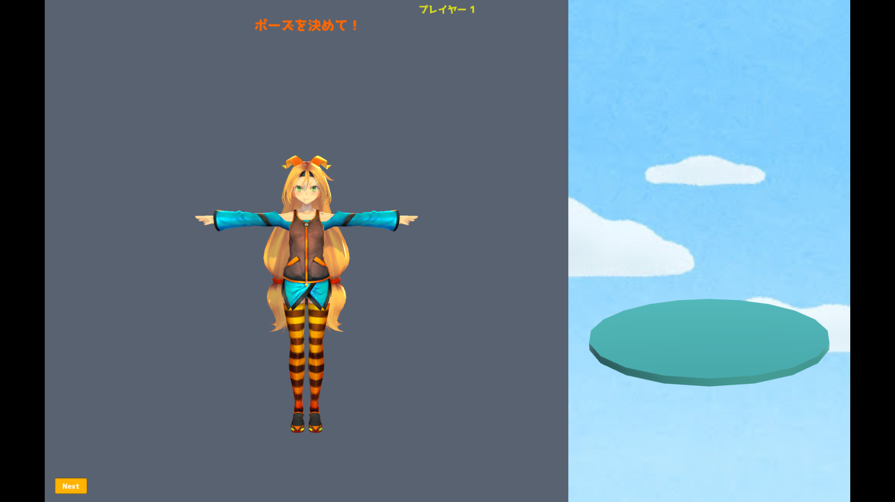
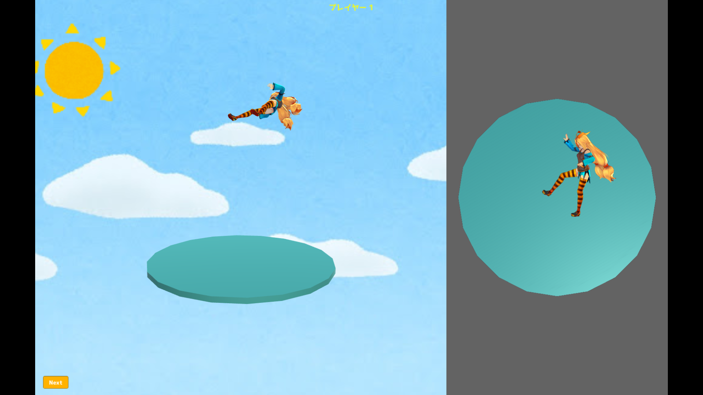
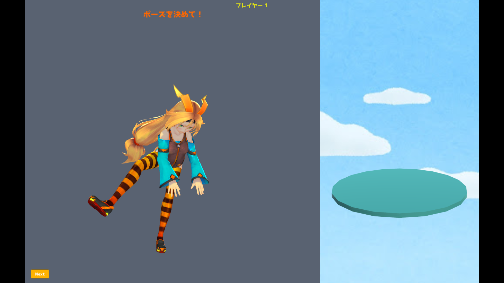
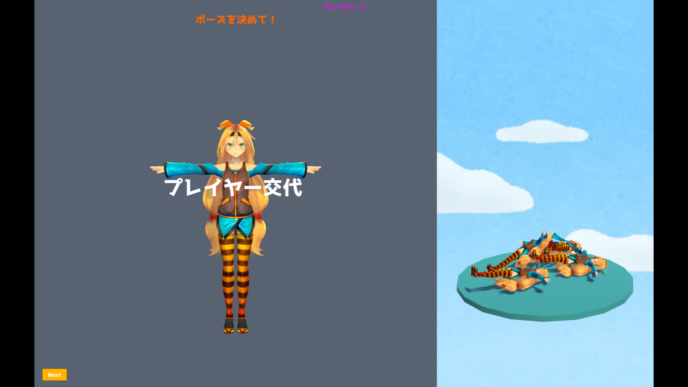

# にんげんタワーバトル（2018年作成）

>説明
- スマートフォンアプリどうぶつタワーバトルを3次元に応用させた。kinectで取得した人間の姿勢をアバターに反映させ，それを交互に土台に積み上げていき，落とした方が負けのゲーム
- kinect v1への接続が必須，wiiリモコンをPCにつなげればwiiリモコンでも操作ができる．
- [kinect sdk](https://www.microsoft.com/en-us/download/details.aspx?id=40278)のインストールが必要
- ./kansei/jprover3.exeを実行するとプレイできる。（Windowsのみ実行可）
>プレイ方法
- Enterキー、Nextボタンで次の画面へ遷移
1. ポーズを決める画面で好きなポーズを取り、次の画面へ遷移する。
2. ポーズが確定したら、落とす位置や姿勢を決めて、次の画面へ
   - 矢印：視点の拡大縮小（上下）、視点の回転（左右）
   - Shift+矢印：落とす位置を決める（上下左右）
   - Tab+矢印：落とす姿勢の変化（上下左右）
3. 落ちて積み重なる動画
4. プレイヤー交代、1へ戻る
5. キャラクターが落ちるとゲーム終了
>プレイ動画
- [プレイ動画　フル](https://youtu.be/TM5SaHDHFiA)
- [プレイ動画　２倍速](https://youtu.be/znHujR9IjLQ)
>プレイ画面

